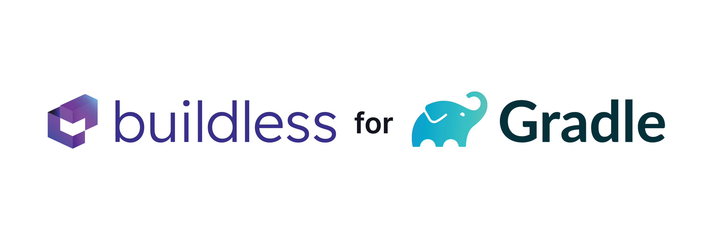

<p align="center">
  <a href="https://less.build">
    <picture>
      <source media="(prefers-color-scheme: dark)" srcset="./dokka/images/masthead-dark@4x.png">
      <source media="(prefers-color-scheme: light)" srcset="./dokka/images/masthead@4x.png">
      
    </picture>
    <br />
  </a>
</p>
<br />

[](https://github.com/buildless/plugin-gradle/actions/workflows/trigger.push.yml)


[](https://codecov.io/gh/buildless/plugin-gradle)
[](https://sonarcloud.io/summary/new_code?id=buildless_plugin-gradle)
[](https://sonarcloud.io/summary/new_code?id=buildless_plugin-gradle)
[](https://sonarcloud.io/summary/new_code?id=buildless_plugin-gradle)
[](http://kotlinlang.org)
[](https://elide.dev)

This repo defines a plugin for Gradle which integrates with [Buildless][1] for [remote build caching][2].
Buildless can be used as a [drop-in remote HTTPS cache endpoint][3], or you can use this plug-in which offers a number
of extra luxurious features (see below).

### Current version

**Latest:** `1.0.0-beta1`

**`settings.gradle.kts` (Kotlin DSL):**
```kotlin
plugins {
    id("build.less") version "1.0.0-beta1"
}
```

**`settings.gradle` (Groovy DSL):**
```groovy
plugins {
    id 'build.less' version '1.0.0-beta1'
}
```

**`libs.versions.toml` (Version Catalog):**
```toml
[versions]
# ...
buildless = "1.0.0-beta1"

[plugins]
# ...
buildless = { id = "build.less", version.ref = "buildless" }
```

## Getting started

Installing and using the plugin is pretty easy.

1. **Install the plugin** in your `settings.gradle` file (see above)
2. **Set your API key** via the Gradle DSL, env vars, config files, or JVM or Gradle properties (see below)
3. ???
4. **Profit!** (Enjoy lightning-fast build caching)

Of course, if you want to, you can customize the plugin's settings to your heart's content. Settings are documented
below the _Features_ section in this README.

## Features

- 🔑 **Automatically load API keys** from environment vars, `.env`, config files, or Gradle or JVM properties
- 🧠 **Smart auto-configuration** of lowest-latency endpoints based on your location
- 📡 **Build telemetry** for enhanced cache reporting and performance
- 🔧 **Configure Gradle build caching** in one combined block, with our without using Buildless

We have more exciting features coming soon! Check out our [public roadmap][4] for more info.

## Configuration

The plugin provides a **Gradle DSL** for configuring Buildless with Gradle, and additionally provides project-level
customizations and checks.

**The most important thing to set up is your API key.** There are several ways to specify your key; they are listed
exhaustively below, with their order of precedence.

#### Complete configuration sample

**`settings.gradle.kts` (Kotlin DSL):**
```kotlin
import build.less.plugin.gradle.settings.*

plugins {
  id("build.less") version "1.0.0-beta1"
}

buildless {
  // various flags:
  debug = true  // activate or deactivate debug mode (verbose logging, API tracing, etc)
  telemetry = true  // activate or deactivate private build telemetry (build analytics in the dashboard)
  reportErrors = true  // activate or deactivate error reporting to the buildless team (just plugin errors)

  // options for configuring your API key:
  apiKey("...")
  apiKey(ApiKey.of("..."))
  apiKey(ApiKey.of("...", type = SubjectType.ORG))

  // configuring local caching (it defaults to being active):
  localCache.enabled = true  // turn the local cache on or off
  localCache.directory = "..."  // set the directory where the cache is stored (defaults to .gradle/cache)

  // or...
  localCache {
    enabled = true
    directory = "..."
  }

  // configuring remote caching (it defaults to being active):
  remoteCache.enabled = true  // turn the remote cache on or off
  remoteCache.endpoint = "..."  // set a custom or enterprise cache endpoint (not usually necessary)

  // or...
  remoteCache {
      enabled = true
      endpoint = "..."
  }
}
```

### API key

Builds use your **regular API key**, not your events key. Once you setup your Buildless account, you can find your key
in your [dashboard][5], either in the *Tenant > Settings* section (for an org-level key), or in your *Profile* (for your
user-level key).

Once you obtain your API key, you can set it up in any of the following ways. The first key found (from top to bottom in
this document) will be used:

- **1) DSL string** (not recommended). For example:
  ```kotlin
  buildless {
    apiKey("...")
  }
  ```

- **2) Environment variables**. All the following values work:
  - `BUILDLESS_TOKEN`
  - `BUILDLESS_API_KEY`
  - `BUILDLESS_APIKEY`
  - `GRADLE_CACHE_PASSWORD`

- **3) Gradle or JVM system properties**. All the following values work:
  - `buildless.apiKey`
  - `cachePassword`

- **4) Config file (recommended)**. All the following locations work (project root unless otherwise specified):
  - `.buildless.toml`, `.buildless.yaml`, `.buildless.json` (with or without preceding `.`)
  - `.github/.buildless.toml`, `.github/.buildless.yaml`, `.github/.buildless.json` (with or without preceding `.`)
  - `package.json:buildless` (as a JSON object)
  - `~/.config/buildless.toml`, `~/.config/buildless.yaml`, `~/.config/buildless.json` (with or without preceding `.`)

> Note:
> You can find your Buildless API key in your [dashboard][5].

### Debug mode

> Default value: `true`

```kotlin
buildless {
  debug = true  // or `BUILDLESS_DEBUG` or `-Dbuildless.debug` or `-Pbuildless.debug`
}
```

Activating debug mode **activate verbose logging** for the plugin, and additionally marks API calls with trace values
which can be used for diagnosis from the [dashboard][5].

### Telemetry

> Default value: `true`

```kotlin
buildless {
  telemetry = false  // or `BUILDLESS_TELEMETRY` or `-Dbuildless.telemetry` or `-Pbuildless.telemetry`
}
```

Build telemetry is the basis for a great many features in Buildless. After processing, it is handed directly back to you
for use in your [dashboard][5]. Emitting telemetry is recommended in all circumstances (including CI and locally); the
telemetry transport is optimized for low overhead and doesn't block the build.

If you really don't want to emit telemetry, you can disable it as shown above.

### Error reporting

> Default value: `true`

```kotlin
buildless {
  errorReporting = false
}
```

Error reporting is used to send errors to the Buildless team for analysis. It is recommended to leave this on, but if
you are working in an airgapped environment (or just don't want to share that information), you can always turn it off.

## Support

Need help setting up Buildless, or have a question? Drop us a line:

```
email: support at less dot build
phone: +1-844-420-1414
```

Or chat with us anytime via the Intercom widget in the [dashboard][5].

#### Legalese

This software was made by the [Elide][6] team, and is meant for use with [Buildless][1]. You can use it to configure any
local or remote caching in Gradle, though.

[1]: https://less.build
[2]: https://docs.gradle.org/current/userguide/build_cache.html
[3]: https://docs.gradle.org/current/userguide/build_cache.html#sec:build_cache_setup_http_backend
[4]: https://features.less.build
[5]: https://less.build/login
[6]: https://elide.dev
